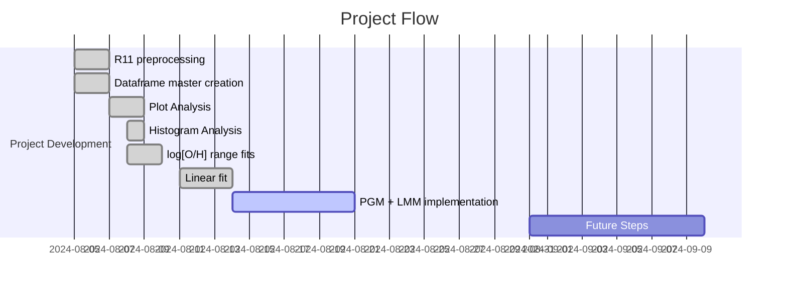

# Project Log and Updates

## Table of Contents
1. [Project Overview](#project-overview)
2. [Project Flow](#project-flow)
3. [Current Stage and Results](#current-stage-and-results)
4. [Next Steps](#next-steps)
5. [Future Ideas](#future-ideas)
6. [Bibliographic References](#bibliographic-references)

---

## Project Overview
This project consists of two parts: the first part focuses on the application of K-Nearest Neighbors (KNN) algorithms for both classification and regression tasks, aiming to predict flood occurrences and quantify key hydrological variables such as water levels and discharge rates. By utilizing a time series dataset spanning several decades, the KNN models are trained to identify patterns and make forecasts with high accuracy. In the second part, the project advances to the development of Recurrent Neural Networks (RNNs), with a specific focus on Long Short-Term Memory (LSTM) networks. LSTM is particularly well-suited for handling sequential data and addressing issues like vanishing gradients, which makes it ideal for further enhancing the predictive capabilities of the models, especially in capturing long-term dependencies in the time series data. Future steps include the implementation and analysis of other types of neural networks such as the Gated Recurrent Unit (GRU) network or Temporal Convolutional Networks (TCNs).

## Project Flow
Here you can check a chronological flow of everything that was done in the project.

### Timeline

### Detailed Flow

| Date | Task | Progress | Notebook |
| --- | --- | --- | --- |
| 2024-08-05 | Preprocessing of data from Riess et al. 2011: `R11` dataset | Done! | [Cepheids Data](https://github.com/GabrielWendell/Cepheids_Projects/blob/main/Project_1/Cepheids_Data.ipynb) |
| 2024-08-05 | Master dataframe preparation: calculation of `d_L`, `M`, `Merr` and `logP` | Done! | [Cepheids Data](https://github.com/GabrielWendell/Cepheids_Projects/blob/main/Project_1/Cepheids_Data.ipynb) |
| 2024-08-06 | Visual analysis of dataframe information: $\log_{10}\text{P}\times M$, $\log_{10}\left[\text{O/H}\right]\times M$ (NGC Number) | Done! | [Cepheids Data](https://github.com/GabrielWendell/Cepheids_Projects/blob/main/Project_1/Cepheids_Data.ipynb) |	
| 2024-08-06 | Analysis of histograms of rotation period frequencies and metallicity by galaxy | Done! | [Cepheids Data](https://github.com/GabrielWendell/Cepheids_Projects/blob/main/Project_1/Cepheids_Data.ipynb) |
| 2024-08-08 | Linear fit for metallicity for different metallicity ranges (Leonardo's idea) | Done! | [Cepheids Data](https://github.com/GabrielWendell/Cepheids_Projects/blob/main/Project_1/Cepheids_Data.ipynb) |
| 2024-08-14 | Linear Fit for the Period of the entire dataset. | Done! | [Cepheids Data](https://github.com/GabrielWendell/Cepheids_Projects/blob/main/Project_1/Cepheids_Data.ipynb) |
| 2024-08-21 | Construction of a PGM model to fit the $(P-L)$ relation for a specific galaxy. | Loading... | [One Galaxy](https://github.com/GabrielWendell/Cepheids_Projects/blob/main/Project_1/Cepheids_One_Galaxy.ipynb) |

## Current Stage and Results
As of the latest update, the project is in the **development phase of PGM and LMM to obtain the $(P-L)$ relation for a specific galaxy**. The latest results are as follows:
- **Key Findings :** Considering the current training and testing sets (1990 - 2022 || 2023), the RNN network with LSTM has proven to be extremely efficient!
- **Performance Metrics :** $a=-7.2781\pm 0.0323\quad,\quad b = -3.1175 \pm 0.1174$
- **Last results obtained :**

  
  

## Next Steps
The upcoming steps in the project include:
1. Increase the number of time steps (`time_steps = 50`) and evaluate the model again ;
2. Implement a GRU type network, evaluate the model and compare it with the LSTM network ;
3. Improve the aesthetics of all graphics and make them publishable quality ;
4. Create a log using `loguru` with the metrics of each model.

## Future Ideas
Here are some potential ideas to explore in the future:
- **Idea 1:** Reduce the training set in order to determine the minimum size that this set should have in order to preserve good model accuracy.
- **Idea 2:** Vary the size of the training and testing set and check the minimum size required for both sets in order to obtain a model with good accuracy.
---

## Bibliographic References
> - RNN & LSTM paper: [Sherstinsky, A., 2020. Fundamentals of recurrent neural network (RNN) and long short-term memory (LSTM) network. *Physica D: Nonlinear Phenomena*, **404**, p.132306.](https://www.sciencedirect.com/science/article/pii/S0167278919305974?casa_token=MfYQf8rsvmMAAAAA:pXVCO-ry4R0Oj_vLaJ541uyI6dcbQ7VTsAyc_elwYzqZDtFzWBBMB3nUsCbmeyuwNXnYjnyk8yQt)
