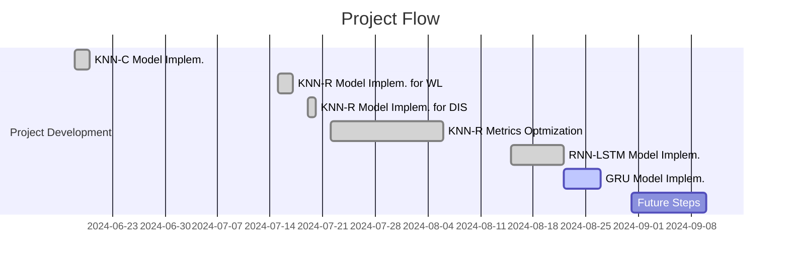

# Project Log and Updates

## Table of Contents
1. [Project Overview](#project-overview)
2. [Project Flow](#project-flow)
3. [Current Stage and Results](#current-stage-and-results)
4. [Next Steps](#next-steps)
5. [Future Ideas](#future-ideas)
6. [Bibliographic References](#bibliographic-references)

---

## Project Overview
This project consists of two parts: the first part focuses on the application of K-Nearest Neighbors (KNN) algorithms for both classification and regression tasks, aiming to predict flood occurrences and quantify key hydrological variables such as water levels and discharge rates. By utilizing a time series dataset spanning several decades, the KNN models are trained to identify patterns and make forecasts with high accuracy. In the second part, the project advances to the development of Recurrent Neural Networks (RNNs), with a specific focus on Long Short-Term Memory (LSTM) networks. LSTM is particularly well-suited for handling sequential data and addressing issues like vanishing gradients, which makes it ideal for further enhancing the predictive capabilities of the models, especially in capturing long-term dependencies in the time series data. Future steps include the implementation and analysis of other types of neural networks such as the Gated Recurrent Unit (GRU) network or Temporal Convolutional Networks (TCNs).

## Project Flow
Here you can check a chronological flow of everything that was done in the project.

### Timeline

### Detailed Flow

| Date | Task | Progress | Notebook |
| --- | --- | --- | --- |
| 2024-06-20 | Implementation of a classification model using KNN | Done! | [Cepheids Data](https://github.com/GabrielWendell/Cepheids_Projects/blob/main/Project_1/Cepheids_Data.ipynb) |
| 2024-07-17 | Implementation of a regression model using KNN to predict the `WATER-LEVEL` feature | Done! | [Cepheids Data](https://github.com/GabrielWendell/Cepheids_Projects/blob/main/Project_1/Cepheids_Data.ipynb) |
| 2024-07-20 | Implementation of a regression model using KNN to predict the `DISCHARGE` feature | Done! | [Cepheids Data](https://github.com/GabrielWendell/Cepheids_Projects/blob/main/Project_1/Cepheids_Data.ipynb) |	
| 2024-08-06 | Obtaining and optimizing metrics (MAE, RMSE, $R^{2}$) for KNN-R | Done! | [Cepheids Data](https://github.com/GabrielWendell/Cepheids_Projects/blob/main/Project_1/Cepheids_Data.ipynb) |
| 2024-08-22 | Implementation of the RNN-LSTM network for predicting the `WATER-LEVEL` feature | Done! | [Cepheids Data](https://github.com/GabrielWendell/Cepheids_Projects/blob/main/Project_1/Cepheids_Data.ipynb) |
| 2024-08-27 | Implementation of the RNN-GRU network for predicting the `WATER-LEVEL` feature | Loading... | [One Galaxy](https://github.com/GabrielWendell/Cepheids_Projects/blob/main/Project_1/Cepheids_One_Galaxy.ipynb) |

## Current Stage and Results
As of the latest update, the project is in the **development phase of PGM and LMM to obtain the $(P-L)$ relation for a specific galaxy**. The latest results are as follows:
- **Key Findings :** Considering the current training and testing sets (1990 - 2022 || 2023), we obtain the following findings
> 1. The KNN-R model proved to be the most effective for the analyzed river station (Kluserbrücke);
> 2. The `WATER-LEVEL` feature generates better metrics, but cannot capture extreme events;
> 3. The `DISCHARGE` feature generates slightly worse metrics, but it can capture extreme events better;
> 4. The RNN-LSTM networks have proven to be extremely efficient in predicting the `WATER-LEVEL` feature.
- **Performance Metrics :**
> - For KNN-R:
>> 1. MAE = 1.2543240547945207
>> 2. RMSE = 2.142504935315682
>> 3. R^2 = 0.9846306950425482
>> 4. Ad-R^2 = 0.984502972286669

> - For RNN-LSTM (preliminary results):
>> 1. MAE = 4.143263212929309
>> 2. RMSE = 7.268499642502091
>> 3. R^2 = 0.8275455406841612
- **Last results obtained :**

  
  

## Next Steps
The upcoming steps in the project include:
1. Implement a GRU type network, evaluate the model and compare it with the LSTM network ;
2. Improve the aesthetics of all graphics and make them publishable quality ;
3. Create a log using `loguru` with the metrics of each model.

## Future Ideas
Here are some potential ideas to explore in the future:
- **Idea 1:** Reduce the training set in order to determine the minimum size that this set should have in order to preserve good model accuracy.
- **Idea 2:** Vary the size of the training and testing set and check the minimum size required for both sets in order to obtain a model with good accuracy.
- **Idea 3:** Implement a regression model with KNN using a weighted distance metric to try to take into account extreme events in the `WATER-LEVEL` and `DISCHARGE` features.
---

## Bibliographic References
> - RNN & LSTM paper: [Sherstinsky, A., 2020. Fundamentals of recurrent neural network (RNN) and long short-term memory (LSTM) network. *Physica D: Nonlinear Phenomena*, **404**, p.132306.](https://www.sciencedirect.com/science/article/pii/S0167278919305974?casa_token=MfYQf8rsvmMAAAAA:pXVCO-ry4R0Oj_vLaJ541uyI6dcbQ7VTsAyc_elwYzqZDtFzWBBMB3nUsCbmeyuwNXnYjnyk8yQt)
